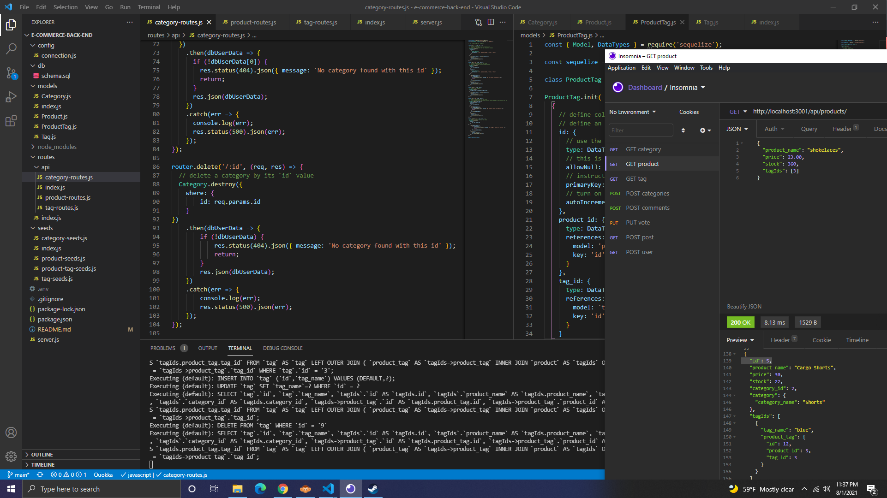

# e-commerce-back-end

  

  ## Description 
  
  An example of the back end for an e-commerce site.
  

  ## Table of Contents
  
  * [Installation](#installation)
  * [Usage](#usage)
  * [Contributing](#Contributing)
  * [Tests](#tests)
  * [Questions](#questions)
  * [License](#license)
  
  
  ## Installation
  
  Clone the repo. Install the dependencies. Start mysql and type `CREATE DATABASE ecommerce_db;` Then type `USE ecommerce_db`. Then type `quit`. Next, type `npm run seed` in the terminal.
  
  
  ## Usage 
  
  To see the back end in action, type "npm start" to start the server. 
  [Instructional Video part 1](https://drive.google.com/file/d/1j8MrW320vNCSrhxtNiyAmzM25UmICDvk/view)
  [Instructional Video part 2](https://drive.google.com/file/d/11x3ogB4w34G2rLFoVjXa2LB6TMB7hCnM/view)

  
  
  ## Contributing

  
  
  [Contributor Covenant](https://www.contributor-covenant.org/version/2/0/code_of_conduct/)

  ## Tests
  
  Testing routes can be done in Insomnia or similar program or in the we browser.

  ## Questions

  You can checkout my repos here: [https://github.com/jfocha](https://github.com/jfocha)

  For further questions, I can also be reached at jfocha@gmail.com

  ## License
  
  Copyright (c) 2021 by Joseph Focha

  This application license is covered under [MIT License](https://choosealicense.com/licenses/mit/)
  
  Permission is hereby granted, free of charge, to any person obtaining a copy of this software and associated documentation files (the 'Software'), to deal in the Software without restriction, including without limitation the rights to use, copy, modify, merge, publish, distribute, sublicense, and/or sell copies of the Software, and to permit persons to whom the Software is furnished to do so, subject to the following conditions:     The above copyright notice and this permission notice (including the next paragraph) shall be included in all copies or substantial portions of the Software.     THE SOFTWARE IS PROVIDED 'AS IS', WITHOUT WARRANTY OF ANY KIND, EXPRESS OR IMPLIED, INCLUDING BUT NOT LIMITED TO THE WARRANTIES OF MERCHANTABILITY, FITNESS FOR A PARTICULAR PURPOSE AND NONINFRINGEMENT. IN NO EVENT SHALL THE AUTHORS OR COPYRIGHT HOLDERS BE LIABLE FOR ANY CLAIM, DAMAGES OR OTHER LIABILITY, WHETHER IN AN ACTION OF CONTRACT, TORT OR OTHERWISE, ARISING FROM, OUT OF OR IN CONNECTION WITH THE SOFTWARE OR THE USE OR OTHER DEALINGS IN THE SOFTWARE.
  
  ---

  
